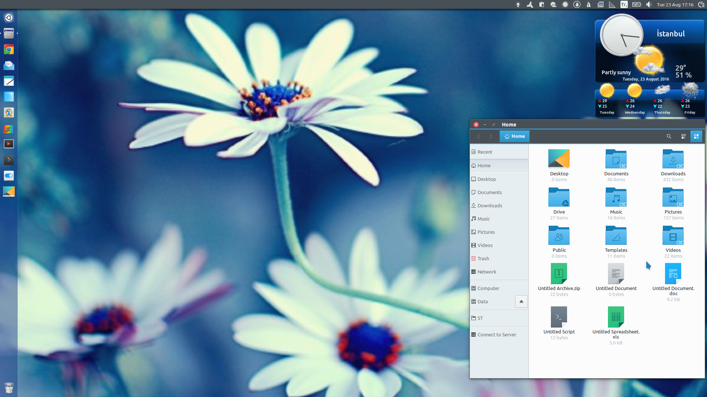

**Breeze Icon Theme, the GTK Version**

This is a slightly modified variation of the great KDE Plasma 5 icon theme.

> ***Fallback Icon Theme:*** https://github.com/vinceliuice/emerald-icons-theme

> Also borrowed are *File Manager* (color-adjusted) & *Trash* icons from the *Humanity* icon theme, *system-devices-panel* icons from the *Numix* icon theme.

This project is essentially aimed at making the great *Breeze* icon usable in *Ubuntu* as well.
Although it is available in official *Ubuntu* repositories, the package *breeze-icon-theme* is not updated regularly and it's not quite usable without some customization.

The script *Breeze-Mod.sh* can be used either to quickly install (or update) this icon theme for use with a light GTK theme (preferably the matching *Breeze GTK Theme*) featuring a **dark top panel**, or to get an idea of what can be done for a custom install (e.g. for use with other GTK themes).
